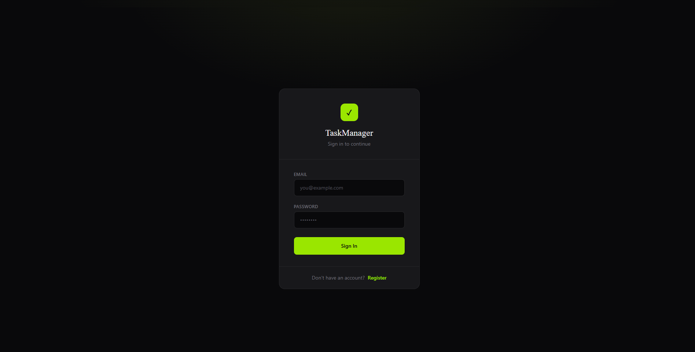

# Task Manager

> A full-stack enterprise application built with .NET 10, Angular, and Docker.

This repository contains a containerized web application designed for performance and scalability. The backend is powered by a **.NET 10** Web API, the frontend is a modern **Angular** application, and the entire stack (including the database) is orchestrated using **Docker Compose**.


---

## Tech Stack

* **Backend:** .NET 10 (MVC), Entity Framework Core
* **Frontend:** Angular, TypeScript, TailwindCSS 
* **Database:** PostgreSQL 
* **Infrastructure:** Docker, Docker Compose

---

## Prerequisites

Before you begin, ensure you have the following installed on your local machine:

* [Docker Desktop](https://www.docker.com/products/docker-desktop)
* [.NET 10 SDK](https://dotnet.microsoft.com/download/dotnet/10.0)
* [Node.js](https://nodejs.org/) (v20+ recommended)
* [Angular CLI](https://angular.io/cli) (`npm install -g @angular/cli`)

---

## Project Structure

```text
NewTaskManager/
├── TaskManager/                    # .NET Backend
│   ├── TaskManager/                # Main project
│   │   ├── Controllers/            # API controllers
│   │   ├── Data/                   # DbContext
│   │   ├── Middleware/             # Global exception handler
│   │   ├── Migrations/             # EF Core migrations
│   │   ├── Models/                 # Entity models
│   │   ├── Properties/             # Launch settings
│   │   ├── Security/               # Auth interfaces & token service
│   │   ├── Services/               # Business logic
│   │   ├── appsettings.json        # App configuration
│   │   ├── Program.cs              # Entry point & DI setup
│   │   └── TaskManager.csproj      # Project file
│   ├── TaskManager.Tests/          # Unit tests
│   └── Dockerfile                  # Backend Docker build
├── TaskManagerUI/                  # Angular Frontend
│   ├── src/
│   │   ├── app/
│   │   │   ├── auth/               # Auth service, interceptor & guard
│   │   │   ├── components/         # Login & task manager components
│   │   │   ├── models/             # Task & DTO models
│   │   │   ├── services/           # Task service
│   │   │   ├── app.config.ts       # App providers
│   │   │   ├── app.routes.ts       # Route definitions
│   │   │   ├── app.ts              # Root component
│   │   │   └── app.html            # Root template
│   │   ├── environments/
│   │   │   ├── environment.ts          # Local dev config
│   │   │   └── environment.production.ts  # Production config
│   │   └── main.ts                 # Browser entry point
│   └── Dockerfile                  # Frontend Docker build
├── .dockerignore
├── .env                            # Environment variables (do not commit)
├── docker-compose.yml              # Multi-container setup
└── README.md
